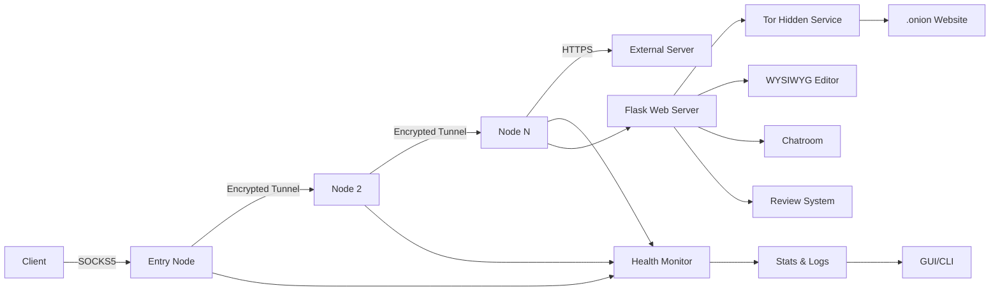

```mermaid
graph TD
    A[99Proxys v3.5] --> B[Security]
    A --> C[Performance]
    A --> D[Usability]
    A --> E[Monitoring]
    A --> F[Web Features]
    B --> B1[SSL/TLS]
    B --> B2[RSA Encryption]
    B --> B3[Fernet Encryption]
    B --> B4[Rate Limiting]
    B --> B5[CSRF Protection]
    B --> B6[Input Validation]
    C --> C1[Bandwidth Throttling]
    C --> C2[Thread Safety]
    C --> C3[Optimized Sockets]
    C --> C4[Virtual IP Assignment]
    D --> D1[Rich CLI]
    D --> D2[Tkinter GUI]
    D --> D3[Setup Wizard]
    D --> D4[WYSIWYG Editor]
    E --> E1[Health Checks]
    E --> E2[Real-Time Stats]
    E --> E3[Exportable Data]
    F --> F1[Multi-Page Websites]
    F --> F2[Chatrooms]
    F --> F3[Review System]
    F --> F4[Tor Hidden Services]
```

# 💻 99Proxys v3.5 by BG Gremlin Group 📡

<p align="center">
  <strong>Proprietary Software for the Elite. Crafted for Unique Individuals.</strong><br>
  A private, local VPN-like proxy chain with 99 global locales, built for stealth, speed, and style.<br>
  <em>By the BG Gremlin Group — Where Innovation Meets Edge.</em>
</p>

<p align="center">
  <a href="#features">Features</a> •
  <a href="#installation">Installation</a> •
  <a href="#usage">Usage</a> •
  <a href="#architecture">Architecture</a> •
  <a href="#contributions">Contributions</a> •
  <a href="#license">License</a>
</p>

---

## 🖤 Welcome to 99Proxys v3.5

**99Proxys** is more than a tool—it's a lifestyle. Developed by the **BG Gremlin Group (BGGG)**, this proprietary software delivers a cutting-edge, local proxy chain that simulates a global VPN network with 99 unique locales. Designed for those who demand unparalleled privacy, performance, and creativity, 99Proxys v3.5 introduces powerful features like a WYSIWYG website editor, real-time chatrooms, and a robust review system, all wrapped in a sleek, user-friendly interface.

> **BGGG**: *Creating unique tools for unique individuals.*

---

## 🌟 Features

99Proxys v3.5 elevates the proxy experience with advanced features tailored for anonymity, usability, and innovation. Here's what's new and improved:

| Feature | Description |
|---------|-------------|
| **Global Locale Simulation** | Emulate 99 countries with realistic IPs, timezones, and geolocation data using `timezonefinder` and `pytz`. |
| **SOCKS5 with SSL/TLS** | Secure proxy connections with end-to-end encryption and self-signed certificates. |
| **RSA + Fernet Encryption** | Dual-layer encryption for secure data transmission between nodes. |
| **Dynamic Bandwidth Throttling** | Precise bandwidth control using a token bucket algorithm, configurable per node. |
| **Rate Limiting** | Per-node request limits to prevent abuse, configurable via `rate_limit`. |
| **Health Monitoring** | Auto-restart failed nodes with real-time health checks and detailed logging. |
| **Rich CLI & GUI** | Sleek CLI with `rich` and a Tkinter GUI with live latency/bandwidth graphs using `matplotlib`. |
| **Real-Time Stats** | Track requests, latency, bandwidth, errors, and connection times in real time. |
| **GeoIP Simulation** | Country-specific IP ranges with virtual IP assignment using `scapy` for authentic proxy chaining. |
| **Exportable Stats** | Save performance data to JSON for analysis and debugging. |
| **WYSIWYG Editor** | Create and edit multi-page websites with a real-time HTML editor powered by Ace. |
| **Real-Time Chatrooms** | Persistent, website-specific chatrooms using `flask_socketio` for user interaction. |
| **Review System** | Submit and view user reviews for websites, secured with CSRF protection via `flask_wtf`. |
| **Testing Framework** | Comprehensive `unittest` suite for nodes, websites, reviews, chat, and bandwidth throttling. |
| **Tor Hidden Services** | Host websites as Tor hidden services with `.onion` addresses for enhanced anonymity. |
| **Input Validation** | Robust validation for all user inputs, including `secure_filename` for Flask routes. |
| **Comprehensive Documentation** | Detailed docstrings and a generated `docs/README.md` for setup and usage. |

### 📊 Feature Chart


---

## 🛠 Installation

### Prerequisites
- **Python 3.8+**
- **Operating Systems**: Windows, Linux, macOS
- **Tor**: Installed and accessible (e.g., `/usr/bin/tor` on Linux)
- **Dependencies**:
  | Package | Version |
  |---------|---------|
  | scapy | >=2.5.0 |
  | rich | >=13.7.1 |
  | plotext | >=5.2.8 |
  | psutil | >=5.9.8 |
  | requests | >=2.31.0 |
  | cryptography | >=42.0.5 |
  | timezonefinder | >=6.1.9 |
  | matplotlib | >=3.8.3 |
  | flask | >=2.3.3 |
  | flask-socketio | >=5.3.6 |
  | flask-sqlalchemy | >=3.0.5 |
  | werkzeug | >=3.0.1 |
  | tkinterweb | >=3.17.3 |
  | flask-wtf | >=1.2.1 |
  | pytz | >=2023.3 |

### Steps
1. **Clone the Repository** (Testers Only):
   ```bash
   git clone <private-repo-url>
   cd 99proxys
   ```

2. **Install Dependencies**:
   ```bash
   pip install -r requirements.txt
   ```
   *Note*: The script auto-installs dependencies on first run.

3. **Install Tor**:
   - Ensure Tor is installed and the executable path is set in `config/99proxys_config.json` (`TOR_PATH`).
   - Example for Linux: `sudo apt-get install tor`.

4. **Generate SSL Certificates**:
   - The app generates self-signed SSL certificates (`server.crt`, `server.key`) in the `certs/` directory on first run.

5. **Run the Application**:
   - **GUI Mode** (default):
     ```bash
     python main.py
     ```
   - **CLI Mode**:
     ```bash
     python main.py --cli
     ```

6. **Run Tests** (Optional):
   ```bash
   python -m unittest tests/test_proxy.py
   ```

*Note*: Virtual IP assignment requires root privileges. Run with `sudo` or configure `setcap` for network capabilities.

---

## 🚀 Usage

### CLI Interface
Launch the CLI for a classic experience:
```bash
python main.py --cli
```

**Menu Options**:
| Option | Action |
|--------|--------|
| 1 | Setup Nodes |
| 2 | Roll All Nodes |
| 3 | Roll Single Node |
| 4 | Stop Single Node |
| 5 | Show Stats |
| 6 | Plot Stats |
| 7 | Stop All Nodes |
| 8 | Run Setup Wizard |
| 9 | Export Stats |
| 10 | Create Website |
| 11 | Import Website Assets |
| 0 | Exit |

**Example**:
```bash
$ python main.py --cli
🔥 99Proxys v3.5 - Private Local VPN Network 🔥
1. Setup Nodes
2. Roll All Nodes
...
10. Create Website
Enter choice: 10
Enter website name: my_site
Enter number of pages: 2
[green]Successfully created website 'my_site' with 2 pages[/green]
```

### GUI Interface
Launch the GUI for a sleek, visual experience:
```bash
python main.py
```

**GUI Features**:
- Real-time node status table with IP, MAC, and locale details
- Live latency and bandwidth graphs using `matplotlib`
- Individual node controls (roll/stop/restart)
- Website creation and asset import tools
- WYSIWYG editor for real-time website editing
- Setup wizard for configuration
- Export stats to JSON
- Website list with `.onion` addresses and port details

### Accessing Websites
- **Onion Addresses**: Access websites via Tor Browser using the `.onion` address displayed in the GUI or logs.
- **Chatrooms**: Navigate to `/chat` on a website to join its real-time chatroom.
- **Reviews**: Visit `/reviews` to submit or view user reviews for a website.

### Configuration
Edit `config/99proxys_config.json` or use the Setup Wizard:
```json
{
  "node_count": 5,
  "ip_range": "192.168.0.0/16",
  "locales": ["USA", "Japan", "Germany", "Brazil", "Australia"],
  "min_port": 1024,
  "max_port": 65535,
  "min_speed_kbps": 56,
  "max_bandwidth_kbps": 1000,
  "rate_limit": 100,
  "tor_path": "/usr/bin/tor",
  "web_port": 5000
}
```

### Testing
Run the test suite to verify functionality:
```bash
python -m unittest tests/test_proxy.py
```

---

## 🧠 Architecture

99Proxys v3.5 is designed for modularity, security, and scalability. Here's how it works:



- **ProxyNode**: Handles SOCKS5 connections with SSL/TLS, RSA, and Fernet encryption, plus virtual IP/MAC assignment via `scapy`.
- **ProxyChain**: Manages node lifecycle, IP/MAC rotation, Tor hidden services, and website creation.
- **GUI/CLI**: Provides user interfaces for control, monitoring, and website management.
- **Flask Web Server**: Hosts websites, chatrooms, reviews, and the WYSIWYG editor with `flask_socketio` and `flask_sqlalchemy`.
- **Health Monitor**: Ensures node reliability with auto-restarts and detailed logging.
- **Database**: Stores website metadata, pages, reviews, and chat messages using SQLite.

---

## 🛡️ Contributions

**99Proxys is proprietary software by the BG Gremlin Group.** We are currently **accepting tester contributions only**. No pull requests are accepted at this time.

### How to Contribute as a Tester
1. Request access to the private repository from BGGG.
2. Test the software in various environments (Windows, Linux, macOS).
3. Test website creation, chatrooms, reviews, and the WYSIWYG editor.
4. Report bugs, performance issues, or suggestions via the designated tester feedback channel.
5. Include detailed logs from `logs/` and exported stats from `data/`.

**Tester Guidelines**:
- Test with different node counts (5–99).
- Verify locale simulation, IP rotation, and timezone accuracy.
- Stress-test bandwidth throttling, rate limiting, and Tor hidden services.
- Check GUI and CLI responsiveness, including website and editor functionality.
- Run the test suite and report any failures.

**Contact**: Reach out to BGGG at [https://github.com/BGGremlin-Group](https://github.com/BGGremlin-Group) for access.

---

## 📜 License

**Proprietary Software © 2025 BG Gremlin Group**

All rights reserved. Unauthorized copying, distribution, or modification is strictly prohibited. Licensed testers may use the software for testing purposes only, as per the BGGG Tester Agreement.

---

<p align="center">
  <strong>BG Gremlin Group</strong><br>
  <em>Creating unique tools for unique individuals.</em><br>
</p>

---