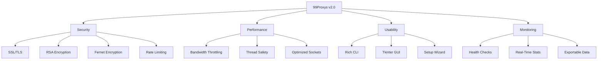
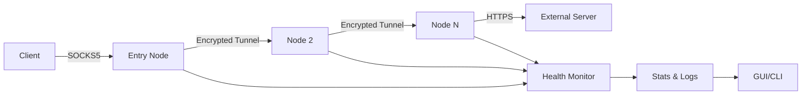

<h1 align="center">🔥 99Proxys v2.0 by BG Gremlin Group 🔥</h1>

<p align="center">
  <strong>Proprietary Software for the Elite. Crafted for Unique Individuals.</strong><br>
  A private, local VPN-like proxy chain with 99 global locales, built for stealth, speed, and style.<br>
  <em>By the BG Gremlin Group — Where Innovation Meets Edge.</em>
</p>

<p align="center">
  <a href="#features">Features</a> •
  <a href="#installation">Installation</a> •
  <a href="#usage">Usage</a> •
  <a href="#architecture">Architecture</a> •
  <a href="#contributions">Contributions</a> •
  <a href="#license">License</a>
</p>

---

## 🖤 Welcome to 99Proxys v2.0

**99Proxys** is not just a tool—it's a lifestyle. Developed by the **BG Gremlin Group (BGGG)**, this proprietary software delivers a cutting-edge, local proxy chain that simulates a global VPN network with 99 unique locales. Designed for those who demand privacy, performance, and a touch of rebellion, 99Proxys v2.0 is your gateway to secure, anonymized browsing with an interface that's as slick as it is powerful.

> **BGGG**: *Creating unique tools for unique individuals.*

---

## 🌟 Features

99Proxys v2.0 is packed with features that make it a beast in the proxy world. Here's what sets it apart:

| Feature | Description |
|---------|-------------|
| **Global Locale Simulation** | Emulate 99 countries with realistic IPs, timezones, and geolocation data. |
| **SOCKS5 with SSL/TLS** | Secure proxy connections with end-to-end encryption. |
| **RSA + Fernet Encryption** | Dual-layer encryption for unbreakable data security. |
| **Dynamic Bandwidth Control** | Throttle bandwidth based on system resources and config. |
| **Rate Limiting** | Prevent abuse with per-node request limits. |
| **Health Monitoring** | Auto-restart failed nodes with real-time health checks. |
| **Rich CLI & GUI** | Sleek CLI with `rich` and a Tkinter GUI with live graphs. |
| **Real-Time Stats** | Track requests, latency, bandwidth, and errors. |
| **GeoIP Simulation** | Country-specific IP ranges for authentic proxy chaining. |
| **Exportable Stats** | Save performance data to JSON for analysis. |

### 📊 Feature Chart


---

## 🛠 Installation

### Prerequisites
- **Python 3.8+**
- **Operating Systems**: Windows, Linux, macOS
- **Dependencies**:
  | Package | Version |
  |---------|---------|
  | scapy | >=2.5.0 |
  | rich | >=13.7.1 |
  | plotext | >=5.2.8 |
  | psutil | >=5.9.8 |
  | requests | >=2.31.0 |
  | cryptography | >=42.0.5 |
  | timezonefinder | >=6.1.9 |
  | matplotlib | >=3.8.3 |

### Steps
1. **Clone the Repository** (Testers Only):
   ```bash
   git clone <private-repo-url>
   cd 99proxys
   ```

2. **Install Dependencies**:
   ```bash
   pip install -r requirements.txt
   ```
   *Note*: The script auto-installs dependencies on first run.

3. **Generate SSL Certificates**:
   - The app generates self-signed SSL certificates (`server.crt`, `server.key`) in the `certs/` directory.

4. **Run the Application**:
   - **GUI Mode** (default):
     ```bash
     python 99proxys.py
     ```
   - **CLI Mode**:
     ```bash
     python 99proxys.py --cli
     ```

---

## 🚀 Usage

### CLI Interface
Launch the CLI for a classic experience:
```bash
python 99proxys.py --cli
```

**Menu Options**:
| Option | Action |
|--------|--------|
| 1 | Setup Nodes |
| 2 | Roll All Nodes |
| 3 | Roll Single Node |
| 4 | Stop Single Node |
| 5 | Show Stats |
| 6 | Plot Stats |
| 7 | Stop All Nodes |
| 8 | Run Setup Wizard |
| 9 | Export Stats |
| 0 | Exit |

**Example**:
```bash
$ python 99proxys.py --cli
🔥 99Proxys - Private Local VPN Network 🔥
1. Setup Nodes
2. Roll All Nodes
...
Enter choice: 1
[green]Successfully set up 5 nodes[/green]
```

### GUI Interface
Launch the GUI for a sleek, visual experience:
```bash
python 99proxys.py
```

**GUI Features**:
- Real-time node status table
- Live latency and bandwidth graphs
- Individual node controls (roll/stop)
- Setup wizard for configuration
- Export stats to JSON

### Configuration
Edit `config/99proxys_config.json` or use the Setup Wizard:
```json
{
  "node_count": 5,
  "ip_range": "192.168.0.0/16",
  "locales": ["USA", "Japan", "Germany", "Brazil", "Australia"],
  "min_port": 1024,
  "max_port": 65535,
  "min_speed_kbps": 56,
  "max_bandwidth_kbps": 1000,
  "rate_limit": 100
}
```

---

## 🧠 Architecture

99Proxys v2.0 is built for modularity and performance. Here's how it works:



- **ProxyNode**: Handles SOCKS5 connections with SSL/TLS, RSA, and Fernet encryption.
- **ProxyChain**: Manages node lifecycle, IP/MAC rotation, and configuration.
- **GUI/CLI**: Provides user interfaces for control and monitoring.
- **Health Monitor**: Ensures node reliability with auto-restarts.

---

## 🛡️ Contributions

**99Proxys is proprietary software by the BG Gremlin Group.** We are currently **accepting tester contributions only**. No pull requests are accepted at this time.

### How to Contribute as a Tester
1. Request access to the private repository from BGGG.
2. Test the software in various environments (Windows, Linux, macOS).
3. Report bugs, performance issues, or suggestions via the designated tester feedback channel.
4. Include detailed logs from `logs/` and exported stats from `data/`.

**Tester Guidelines**:
- Test with different node counts (5–99).
- Verify locale simulation and IP rotation.
- Stress-test bandwidth and rate limiting.
- Check GUI and CLI responsiveness.

**Contact**: Reach out to BGGG at `[https://github.com/BGGremlin-Group/99Proxys]` for access.

---

## 📜 License

**Proprietary Software © 2025 BG Gremlin Group**

All rights reserved. Unauthorized copying, distribution, or modification is strictly prohibited. Licensed testers may use the software for testing purposes only, as per the BGGG Tester Agreement.

---

<p align="center">
  <strong>BG Gremlin Group</strong><br>
  <em>Creating unique tools for unique individuals.</em><br>
</p>
```
